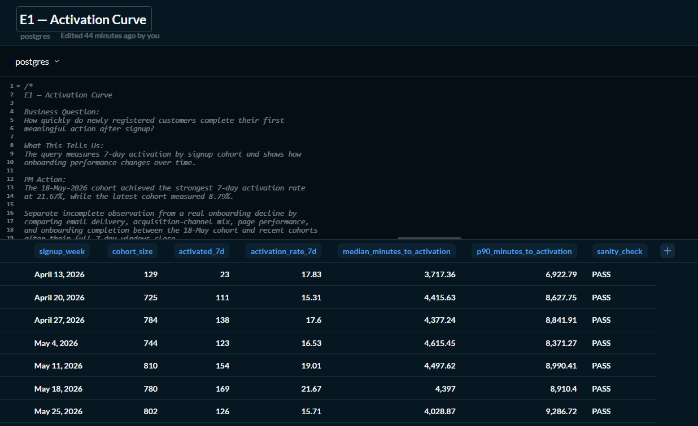
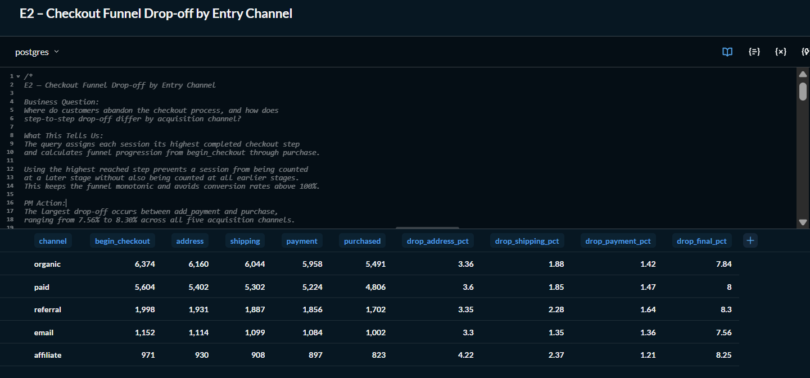
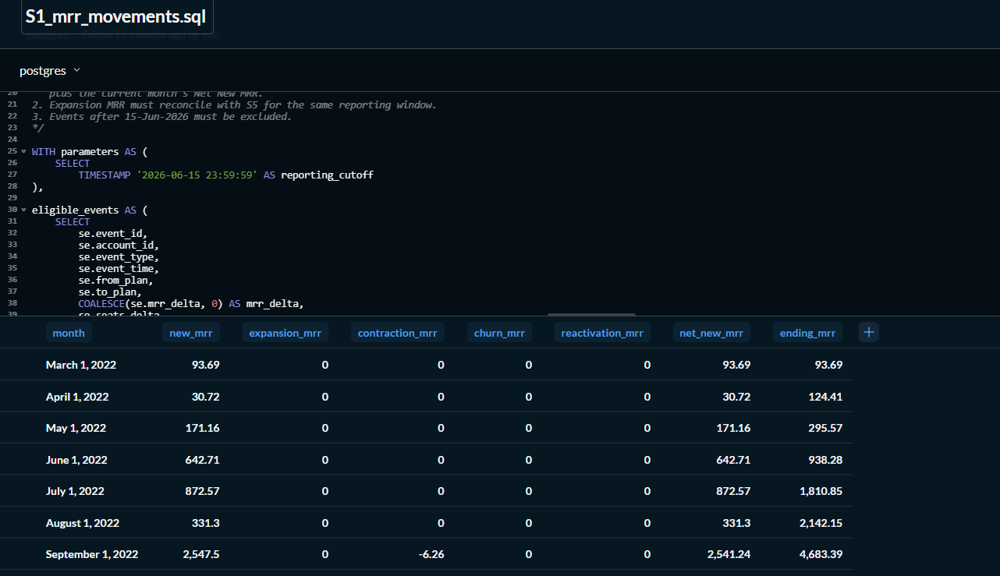
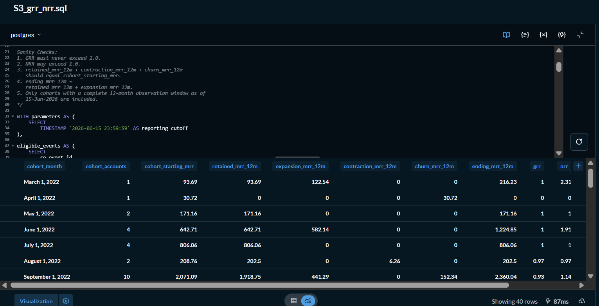
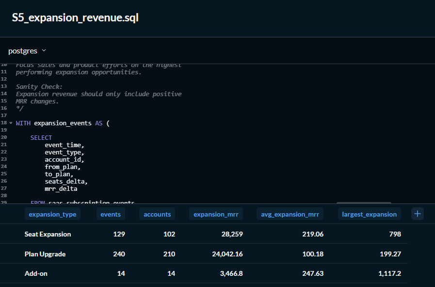

# SQL Product Analytics Portfolio – E-commerce & SaaS Business Case Studies

## Executive Summary

This repository contains 10 end-to-end SQL business case studies across both B2C E-commerce and B2B SaaS products.

Key findings include:

- Customer activation peaked at **21.67%** before declining in recent cohorts.
- Checkout consistently lost **7.56%–8.30%** of customers at the final purchase step.
- Week-1 retention reached **36.30%** for the strongest cohort.
- The September 2022 SaaS cohort achieved **92.64% GRR** and **113.95% NRR**.
- Seat expansion generated **$28,259.00**, making it the largest recurring revenue growth driver.

The project demonstrates how SQL can answer product, growth, finance, and customer-success questions using production-style analytical techniques.

---

## B2C vs B2B Analytics

| Area | E-commerce | SaaS |
|---|---|---|
| Main analytical grain | Session or customer | Account or subscription |
| Typical time horizon | Minutes to weeks | Weeks to months |
| Activation | First meaningful shopping action | Trial conversion or product adoption |
| Funnel | Checkout steps inside a session | Trial → paid → retained → expanded |
| Retention | Customer returns and performs an action | Account continues paying |
| Revenue metric | GMV, conversion and cart value | MRR, GRR, NRR and expansion |
| Primary stakeholders | Product, Growth, Marketing | Product, Finance, Customer Success, Sales |

---

# Executive Business Highlights

| Domain | Actual Finding | Business Value |
|---------|----------------|----------------|
| 🚀 Customer Activation | The highest 7-day activation rate reached **21.67%** (Week of May 18, 2026), while the latest cohort measured **8.79%** because it is still maturing. | Demonstrates how onboarding effectiveness changes across customer cohorts. |
| 🛒 Checkout Funnel | The largest checkout drop-off occurred at the **final Purchase step**, ranging from **7.56%–8.30%** across acquisition channels. | Indicates the biggest opportunity to improve conversion lies in the final payment-to-purchase stage. |
| 🔄 Weekly Retention | Week-1 retention peaked at **36.30%** (May 11 cohort), while recent cohorts naturally show lower later-week retention due to incomplete observation windows. | Highlights customer engagement patterns and cohort maturity effects. |
| 💰 Trial Conversion | Multiple cohorts achieved **100% conversion within 14 days**, while others ranged from **25%–50%**, showing significant variation in onboarding effectiveness. | Helps Product and Growth teams identify high-performing onboarding cohorts. |
| 📈 Revenue Retention | September 2022 cohort achieved **GRR 92.64%** and **NRR 113.95%**, showing expansion revenue more than offset customer losses. | Demonstrates strong expansion opportunities among retained customers. |
| 💵 Expansion Revenue | **Seat Expansion generated $28,259 MRR**, exceeding **Plan Upgrades ($19,360.02)** and **Add-ons ($3,466.80)**. | Indicates that customer growth through additional seats is the strongest expansion driver. |

### Business Impact

- Solved **10 real-world product analytics problems**
- Covered both **B2C (E-commerce)** and **B2B (SaaS)** analytics
- Demonstrated advanced SQL using CTEs, Window Functions, Cohort Analysis, Funnel Analysis, and Revenue Analytics
- Every analysis includes a Business Question, What This Tells Us, PM Action, and Sanity Check.

| Analysis | Key Business Question |
|---|---|
| Activation Curve | How quickly do new customers perform a meaningful action? |
| Checkout Funnel | Where do customers abandon checkout? |
| Weekly Retention | Do customers return after signup? |
| PDP Engagement | Which products attract views but fail to generate cart additions? |
| Cart Abandonment | Which cart-value segments lose the most customers and revenue? |
| MRR Movements | What drove monthly recurring revenue growth or decline? |
| Trial Conversion | How quickly do trial accounts become paying customers? |
| GRR and NRR | How much existing customer revenue is retained after 12 months? |
| Feature Adoption | Which product features are associated with stronger retention? |
| Expansion Revenue | Is expansion driven by seats, plan upgrades or add-ons? |

---

## Query Portfolio

| Query | Stakeholder Question | Key Business Insight | SQL Concepts |
|------|----------------------|----------------------|-------------|
| E1 – Activation Curve | How quickly do customers activate after signup? | Activation peaked at 21.67% before declining to 8.79% in the latest cohort. | Cohort Analysis, Window Functions |
| E2 – Checkout Funnel | Where do customers abandon checkout? | Final purchase step consistently loses 7.56%–8.30% of customers. | Conditional Aggregation |
| E3 – Weekly Retention | Do customers return after signup? | Week-1 retention reached 36.30% in the strongest cohort. | Window Functions |
| E4 – PDP Engagement | Which products have high traffic but poor conversion? | Highlights products requiring merchandising improvements. | Product Analytics |
| E5 – Cart Abandonment | Which carts generate the highest lost revenue? | Quantifies revenue leakage across cart-value segments. | Session Analytics |
| S1 – MRR Movements | What drives monthly revenue growth? | Breaks MRR into New, Expansion, Churn, Contraction, and Reactivation. | Revenue Analytics |
| S2 – Trial Conversion | How quickly do trials become paid customers? | Measures trial effectiveness and conversion speed. | Cohort Analysis |
| S3 – GRR & NRR | How much recurring revenue is retained after one year? | Measures customer revenue retention and expansion. | Revenue Retention |
| S4 – Feature Adoption | Which product features are associated with stronger retention? | Compares retention between feature adopters and eligible non-adopters. | Product Analytics |
| S5 – Expansion Revenue | Where does expansion revenue originate? | Seat additions generated $28,259.00, becoming the largest expansion revenue driver. | Revenue Growth |

---

## Repository Features

✅ 10 Production-ready SQL business case studies

✅ Covers both B2C (E-commerce) and B2B (SaaS) analytics

✅ Every SQL query includes:
- Business Question
- What This Tells Us
- PM Action
- Sanity Check

✅ Built using PostgreSQL

✅ Designed using production-style SQL standards

✅ Suitable for Data Analyst / Senior Data Analyst portfolio

## Tools and Technologies

- PostgreSQL
- Metabase
- GitHub and GitHub Desktop
- SQL CTEs
- Window functions
- Conditional aggregation
- Cohort analysis
- Funnel analysis
- Revenue analytics

---

# Dashboard Highlights

Below are selected Metabase dashboards created as part of this project.

## Customer Activation (E1)



**Key Insight:** Customer activation peaked at **21.67% within 7 days**, while recent cohorts show lower activation because their observation windows are still incomplete.

---

## Checkout Funnel (E2)



**Key Insight:** The largest customer drop-off occurs at the **final Purchase stage (7.56%–8.30%)**, making it the highest-impact opportunity for conversion optimization.

---

## Monthly Recurring Revenue (S1)



**Key Insight:** Monthly recurring revenue was driven by a combination of new subscriptions, customer expansion, contraction, churn, and reactivation, providing Finance with a complete revenue movement breakdown.

---

## Gross Revenue Retention (S3)



**Key Insight:** The **September 2022** cohort achieved **92.64% GRR** and **113.95% NRR**, indicating that expansion revenue more than compensated for churn and contraction.

---

## Expansion Revenue (S5)



**Key Insight:** Seat additions generated **$28,259.00** in expansion MRR, followed by **Plan Upgrades ($19,360.02)** and **Add-ons ($3,466.80)**. Together they reconcile exactly with the S1 expansion total of **$51,085.82**.

## Repository Structure

```text
sql-product-analytics/
├── ecom/
├── saas/
├── notes/
├── images/
└── README.md
```

---

## Data Quality Considerations

The analysis explicitly handles several realistic data issues:

- Inconsistent plan-name casing
- Missing `plan_id` values
- Orphan product-event users
- Future-dated subscription events
- Pre-signup e-commerce events
- Incomplete recent cohorts
- Mixed self-serve and B2B subscription grain

---

## Important Analytical Limitations

Feature adoption and retention are correlated, but the analysis does not prove that feature adoption causes retention. More engaged customers may naturally use more features.

Recent activation, retention and trial-conversion cohorts may be incomplete because their full observation windows have not closed.

---

## Portfolio Case Study

**B2C vs B2B: How Funnels and Retention Actually Differ**

[View the public Notion case study](https://catkin-blizzard-6a0.notion.site/B2C-vs-B2B-How-Funnels-and-Retention-Actually-Differ-3b23f4c48c888018bd36fd809e6bee44?source=copy_link)

---

## Author

**Nithin S.**

Senior Data Analyst portfolio project focused on SQL, product analytics and business decision-making.
