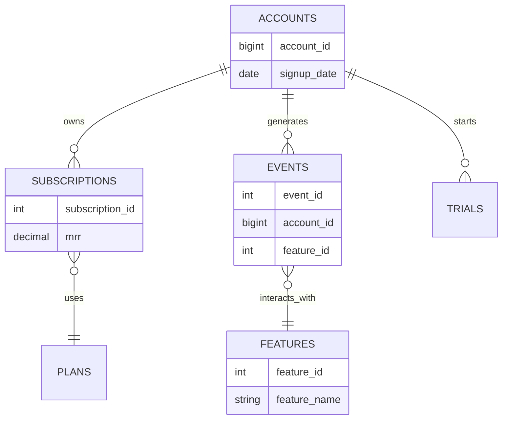

# SaaS Schema Recon

## Overview

The SaaS schema contains 17 active business tables (excluding legacy tables). The schema models customer accounts, users, subscriptions, product usage, billing, payments, trials, feature adoption, support tickets, and A/B experiments.

---

## Entity Relationship Diagram

# Table Inventory

| Table | Approximate Rows | Purpose |
|---------|----------------:|---------|
| accounts | 1,250 | Customer accounts |
| users | 2,556 | Users belonging to customer accounts |
| subscriptions | 2,113 | Subscription records |
| subscription_events | 3,741 | Subscription lifecycle events |
| plans | 8 | Subscription plans |
| invoices | 4,201 | Billing invoices |
| payment_attempts | 5,690 | Payment attempts |
| events | 53,534 | Product usage events |
| trials | 250 | Trial records |
| seats | 1,556 | Licensed seats |
| support_tickets | 1,249 | Customer support requests |
| email_sends | 3,385 | Marketing and notification emails |
| experiments | 4 | A/B experiments |
| experiment_variants | 8 | Experiment variants |
| experiment_assignments | 3,200 | User experiment assignments |
| features | 50 | Product features |

---

# Important Relationships

- accounts.account_id → users.account_id
- accounts.account_id → subscriptions.account_id
- accounts.account_id → trials.account_id
- accounts.account_id → events.account_id
- accounts.account_id → invoices.account_id
- accounts.account_id → payment_attempts.account_id
- users.user_id → subscriptions.user_id
- users.user_id → events.user_id
- users.user_id → experiment_assignments.user_id
- plans.plan_id → subscriptions.plan_id
- subscriptions.subscription_id → subscription_events.subscription_id
- subscriptions.subscription_id → payment_attempts.subscription_id
- features.feature_id → events.feature_id
- experiments.experiment_id → experiment_variants.experiment_id
- experiment_variants.variant_id → experiment_assignments.variant_id

---

# Probe Question 1 – Grain of subscriptions

The subscriptions table has mixed grain.

For Self-Serve customers, subscriptions belong to individual users. Each subscription generally has one seat.

For B2B customers, subscriptions belong to customer accounts. User IDs are NULL and subscriptions may contain multiple seats.

One account may have multiple subscription records representing renewals, upgrades, downgrades, or historical subscriptions.

---

# Probe Question 2 – MRR

The plans table stores catalogue prices.

The subscriptions table stores the actual Monthly Recurring Revenue (MRR).

Stored MRR does not always equal:

Monthly Price × Seat Count

This indicates custom pricing, discounts or enterprise pricing.

The subscription_events table stores revenue movements using mrr_delta.

Positive values represent expansion revenue while negative values represent contraction or churn.

---

# Probe Question 3 – Subscription Status

| Status | Count |
|---------|------:|
| Active | 885 |
| Churned | 557 |
| Trialing | 292 |
| Past Due | 195 |
| Paused | 184 |

Active subscriptions generate most recurring revenue.

All churned subscriptions have a valid cancelled_at timestamp.

---

# Probe Question 4 – Trial vs Paid

The trials table stores:

- started_at
- ends_at
- converted_at
- converted_subscription_id

Average trial duration is 14 days.

Paid subscriptions are identified using Active status.

Current trial users are identified using Trialing status.

---

# Probe Question 5 – Timezone

Database timezone is UTC.

Most lifecycle timestamps use Timestamp With Time Zone.

Some business dates such as signup_date and issue_date use Timestamp Without Time Zone.

---

# Probe Question 6 – Soft Delete

No deleted_at or is_deleted pattern exists.

Lifecycle is managed using:

- status
- cancelled_at
- is_active

instead of soft deletes.

---

# Data Quality Findings

## Finding 1

Plan names are inconsistent.

Examples:

- Pro
- pro
- Enterprise
- enterprise
- professional

Recommendation:

Use LOWER(TRIM(plan)) before analysis.

---

## Finding 2

243 subscriptions (11.5%) have NULL plan_id.

Recommendation:

Use LEFT JOIN when joining to plans.

---

## Finding 3

566 product events have no matching user.

Recommendation:

Exclude orphan events from user-level analysis.

---

## Finding 4

226 subscription events occur after 15-Jun-2026.

Recommendation:

Apply a reporting cutoff date for historical analysis.

---

# Column Dictionary

## accounts

- account_id – Customer account identifier
- account_type – Self-Serve or B2B
- industry – Customer industry
- country – Customer country
- signup_date – Account creation date
- acquisition_channel – Customer acquisition source

## users

- user_id – User identifier
- account_id – Parent account
- signup_date – User registration date
- signup_source – Signup source
- plan_type – User plan
- is_active – User status
- last_login_date – Last login

## subscriptions

- subscription_id – Subscription identifier
- account_id – Customer account
- user_id – User identifier
- plan – Plan name
- plan_id – Plan identifier
- mrr – Monthly recurring revenue
- seat_count – Licensed seats
- status – Subscription status
- start_date – Subscription start
- end_date – Subscription end
- cancelled_at – Cancellation timestamp

## subscription_events

- subscription_id – Subscription identifier
- account_id – Customer account
- user_id – User identifier
- event_type – Lifecycle event
- event_time – Event timestamp
- from_plan – Previous plan
- to_plan – New plan
- mrr_delta – Revenue change
- seats_delta – Seat change

## plans

- plan_id – Plan identifier
- plan_name – Plan name
- monthly_price – Monthly catalogue price
- seat_limit – Maximum seats
- billing_interval – Monthly or Annual

---

# Sample Queries

## Active Paying Accounts

643

## Accounts by Plan

| Plan | Accounts |
|------|---------:|
| Pro | 439 |
| Enterprise | 242 |
| Starter | 176 |
| Free | 121 |

## Sample Subscription Events

Verified subscription lifecycle events including:

- subscription_started
- trial_started
- plan_changed
- trial_converted
- cancelled
- seat_add

---

# Summary

The SaaS schema is designed around customer accounts, subscriptions, product usage, and billing. Subscription history is maintained through lifecycle events, while MRR movements are captured separately using subscription_events. The schema is well suited for product analytics, revenue analysis, feature adoption, churn analysis, and customer lifecycle reporting.

The SaaS schema is designed around customer accounts, subscriptions, product usage, and billing. Subscription history is maintained through lifecycle events, while MRR movements are captured separately using subscription_events. The schema is well suited for product analytics, revenue analysis, feature adoption, churn analysis, and customer lifecycle reporting.
